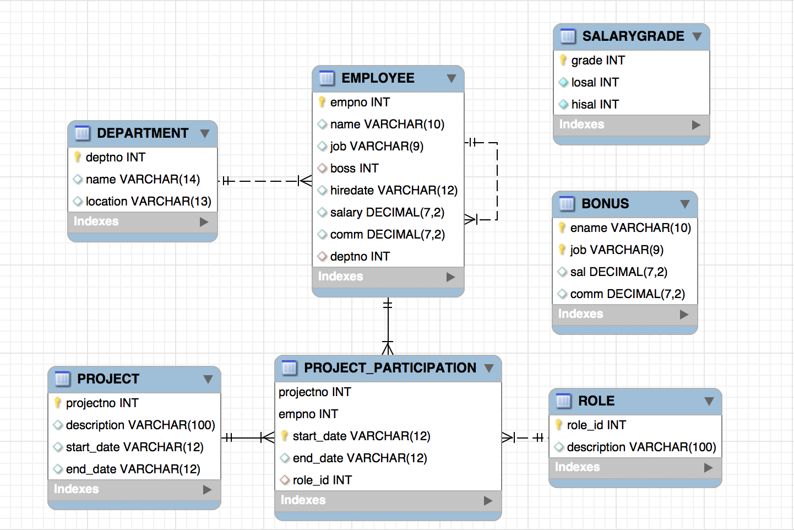

# 180913

## Database Programming

- **DBMS(Database Management System)**  
  : 데이터들(DB)을 관리해 준다. SQL을 사용하려면 필요하다.  
  ex) Oracle, MySQL, MS SQL 등  
- **DB(Database)**  
  : 데이터들의 집합. DBMS에서 만들어주어야 한다.

**SQL(Structured Query Language)**: DBMS에서 data를 조작하기 위한 언어

한 컴퓨터(클라이언트)에 있는 프로그램에서 —> 다른 컴퓨터에 있는 DBMS에 연결 ---> SQL 전송 —> DBMS에서 SQL 실행 —> 결과를 클라이언트에 전송

**Enterprise**: 컴퓨터(DBMS와 연결된)가 여러 대로 분산되어 있는 환경. 데이터베이스 프로그래밍은 분산 프로그래밍의 한 종류.

**Docker**: 내 컴퓨터에서 만든 docker 이미지를 docker 저장소에 올릴 수 있고, 저장소에서 다른 컴퓨터로 이미지를 불러올 수도 있다. 어떤 서버가 다양한 환경에서 모두 잘 동작하는지 테스트하기 위해서, 다양한 환경들을 이미지화해서 docker 저장소에 올려 놓고 서버 개발자가 그 이미지들을 받아 각 환경에서 테스트해 볼 수 있는 것이다. Back-end 개발자에게는 필수.

---

H2를 설치하고 압축을 풀면, /bin에 **h2.sh** 파일이 있다. `chmod 755 h2.sh`를 통해 권한을 부여하고, `./h2.sh`를 입력하면 관리하는 웹서버(H2 Console)에 접속할 수 있다. (H2에 웹서버가 포함되어 있다.)

JDBC URL에는 `jdbc:h2:tcp://localhost/~/test;DB_CLOSE_DELAY=-1`를 입력 후 연결

H2 DBMS —> 사용자 계정별로 DB를 갖고 있다.  
기본적인 사용자: `sa`

DB에 데이터를 저장하기 위해서 데이터가 저장될 틀(Table)을 만들어줘야 한다.

DBMS에서 데이터를 관리하려면, (Boost Course ["SQL이란?"](https://www.edwith.org/boostcourse-web/lecture/16720/) 참고)

1. DBMS 설치
2. Database를 설치
3. Database 사용자를 추가, 해당 사용자에게 특정 Database에 대한 권한을 부여

---

**SQL의 종류**

- **DML**: 조회, 수정, 삭제, 입력 (CRUD)
- **DDL**: Table을 생성, 수정, 삭제
- **DCL**: grant, revoke

Table에는 반드시 **PK**(**Primary Key** 혹은 **식별자**)가 있어야 한다. PK는 유일하면서도 NULL이 아니어야 한다는 제약조건을 말한다. PK로서 기능할 수 있는 속성이 여러 개 있다면, 노출이 되어도 큰 영향 없는 것으로 하는 것이 바람직하다. (ex. 주민번호와 사원번호 중에서는 사원번호를 기본키로 하는 것이 적합)

<u>논리적 모델링</u>: 테이블을 만들기 전. 중복된 데이터가 있으면 안된다. **정규화**(데이터 중복 제거 —> 데이터 무결성 유지)  
<u>물리적 모델링</u>: 논리적 모델을 실제 DB에 사용할 수 있도록 하는 것. 성능이 중요하다.

※ 이론, 기본기가 중요한 이유: 개발자 간의 소통을 위해

<br>

```sql
SELECT * FROM 테이블이름;
SELECT name, age FROM student;
SELECT name FROM (SELECT name, age FROM student);
SELECT * FROM a, b;			/* Cartesian Product */
```

---

### Maven 프로젝트 생성

**Maven**: 빌드, 패키징 등을 자동화할 수 있고, 라이브러리 의존성을 관리한다. 쓰고 싶은 라이브러리가 있으면 `<dependencies></dependencies>` 내부에 추가.

`GroupId`: 보통 도메인 명을 거꾸로 적는다. ex) `my.examples`  
`ArtifactId`: 프로젝트 이름(소문자로 쓴다). ex) `jdbcexam`

-src  
​	-main  
​		-java  
​		-resources  
​	-test  
pom.xml *(maven 설정 파일)*

<br>

**CoC**(**Convention over Configuration**):  
*"대부분의 개발자들이 알다시피"* 라는 의미. 현대의 대부분의 프로그램들은 대부분 CoC를 사용.

소스코드는 `${basedir}/src/main/java`
리소스는 `${basedir}/src/main/resources`
테스트 코드는 `${basedir}/src/test`
컴파일 하면 `${basedir}/target/classes` 에 바이트 코드가 생성되고
배포할 수 있는 JAR 파일은 `${basedir}/target`에 생성될 것이라고 가정한다.

<br>

보통은 IDE(InteilliJ, Eclipse)를 이용하여 컴파일하고 실행하지만,  
JDK, Maven만 설치되어 있다면 콘솔에서 Maven을 이용하여 바로 빌드할 수도 있다.

---

Java에서는 데이터베이스 프로그래밍을 위해 `java.sql` 패키지가 준비되어 있다. 추상클래스를 잘 이용한 패키지이다.

그런데, `java.sql.Connection` 인터페이스는 그것을 구현하고 있는 클래스가 없다.  
DBMS마다 접속하는 방법이 다 다르다. 따라서 Java 언어를 개발하는 쪽에서는 (특정 DBMS와 독립적으로 생각했을 때) 어느 DBMS에서나 필요할 것으로 예상되는 기능 등을 포함한 인터페이스만 제공해 주고, 그것을 구현하는 클래스는 특정 DBMS vendor(회사)가 제공한다. 이를 **JDBC Driver**라고 한다.  

<u>ex) H2 JDBC Driver는?</u> pom.xml에 dependency 추가 ↴

```xml
<dependency>
    <groupId>com.h2database</groupId>
    <artifactId>h2</artifactId>
    <version>1.4.197</version>
    <scope>test</scope>
</dependency>
```

<br>

1. **연결(접속) (& —> 준비 완료)**

```java
Class.forName(DriverClass);
Connection conn = DriverManager.getConnection(url, user, password);
```

`conn`에는 Connection 인터페이스를 구현하는 클래스가 할당되는데, 그 내용은 `.getConnection()` 내부의 url과 관련된 JDBC마다 다를 것이다. `.getConnection()` 안에 들어갈 값을 하드코딩 하지 않고, 다른 파일(ex. `db.properties`)에 저장해 놓고 그 값을 불러오도록 한다면, JDBC Driver를 바꾸거나 user 정보 등을 바꿔야 할 때 `.properties`만 수정하고 위의 Java 코드는 전혀 수정할 필요가 없게 된다.

`Class.forName(DriverClass)`는 전달된 클래스를 메모리에 로드하는 역할을 한다. 만약 `Class.forName("org.h2.Driver");`와 같이 입력한 경우, H2의 driver가 load되는 것이다. 실제 H2의 Driver 클래스 내부를 보면, `DriverManager.registerDriver(INSTANCE);` 라는 코드를 확인할 수 있는데, 이를 통해 자기 자신을 등록하는 과정을 거친다. 이렇게 등록한 driver는 `Connection conn = DriverManager.getConnection(url, user, password);`에서 Connection을 생성하는 과정에서 사용된다.  
*(JDBC 4.0부터는 `Class.forName()`을 쓰지 않아도 자동으로 driver를 load하므로, 수동으로 등록하지 않아도 된다.)*

2. **SQL을 전송(실행)하기 위한 interface를 선언하고, Connection 변수를 이용해 DB에 SQL을 준비**(precompile)**해달라고 한다.**

```java
PreparedStatement ps = conn.prepareStatement(SQL);
```

ps는 DB 안에서 준비된(precompile된) SQL statement를 참조하게 된다.

3. **결과를 읽어오기 위한 ResultSet interface를 선언하고, PreparedStatement 변수를 이용해 준비된 SQL을 실행하게 한다.**

```java
ResultSet rs = ps.executeQuery();
...
while (rs.next()) {...}
...
```

실행한 결과는 DBMS에 있다. rs는 실행된 결과를 참조한다.

```java
import java.sql.Connection;
import java.sql.DriverManager;
import java.sql.PreparedStatement;
import java.sql.ResultSet;

public class JDBCExam {
    public static void main(String[] args) throws Exception {
        // Connection과 관련된 interface를 선언
        Connection conn = null;

        // SQL을 실행하기 위한 interface를 선언
        PreparedStatement ps = null;

        // 결과를 읽어오기 위한 interface를 선언
        ResultSet rs = null;

        try {
            // 1. Driver 등록
            Class.forName("org.h2.Driver");

            String sql = "SELECT role_id, description FROM role WHERE role_id = ?";

            // 2. DB에 연결
            // url은 DBMS마다 형식이 다르다.
            conn = DriverManager.getConnection("jdbc:h2:tcp://localhost/~/test;DB_CLOSE_DELAY=-1",
                    "sa", "");

            ps = conn.prepareStatement(sql);
            ps.setInt(1, 100);  // 바인딩한다 (? 부분을 알려준다)

            // executeQuery(): select문 실행, executeUpdate(): insert, update, delete
            rs = ps.executeQuery();

            while (rs.next()) {
                int roleId = rs.getInt(1);
                String description = rs.getString(2);
                System.out.println(roleId + ", "+ description);
            }
        } catch (Exception ex) {
            ex.printStackTrace();
        } finally {
            // ResultSet, PreparedStatement, Connection은 반드시 finally 블록 안에서 close() 한다.
            try {
                rs.close();
            } catch (Exception ex) {}
            try {
                ps.close();
            } catch (Exception ex) {}
            try {
                conn.close();
            } catch (Exception ex) {}
        }
    }
}
```

<br>

DBMS에서는 SQL을 실행하기 위해 SQL을 파싱하는데, 파싱한 결과를 임시로 저장해 놓는다. 이후에 같은 SQL이 들어오면 파싱 절차를 거치지 않고 있던 값을 가져다 쓰게 된다.  
**PreparedStatement**에서 `"SELECT role_id, description FROM role WHERE role_id = ?"` 와 같이 쓰면, `?` 부분을 빼고 파싱하게 된다. 즉 `?` 부분이 바뀌더라도, `?`부분을 제외하고 파싱 결과를 저장해 놓는다.  
하지만 **Statement**에서는 `?`가 아니라 `" + "` 기호를 사용해 String Concatenation하기 때문에, `?`에 해당하는 부분(변수)의 내용이 바뀔 때마다 그것들을 각각 따로 파싱하게 되어 성능이 좋지 않다. 더불어 SQL injection에도 취약하므로 사용하지 말아야 한다.

<br>

<br>

---

## HW

- **FOREIGN KEY**란?

관계형 데이터베이스에서, 한 테이블의 필드(attribute) 중 다른 테이블의 행(row)을 식별할 수 있는 키를 말한다.

- H2 Console에서 생성한 테이블의 관계에 대하여 그림으로 그린다(ERD). ([GitHub "data.sql"](https://github.com/urstory/fastcampus2/blob/master/db/data.sql) 참고)



