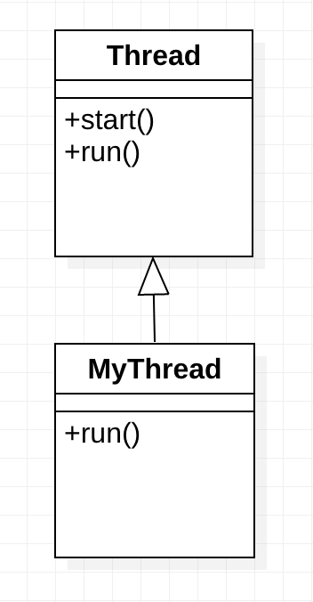
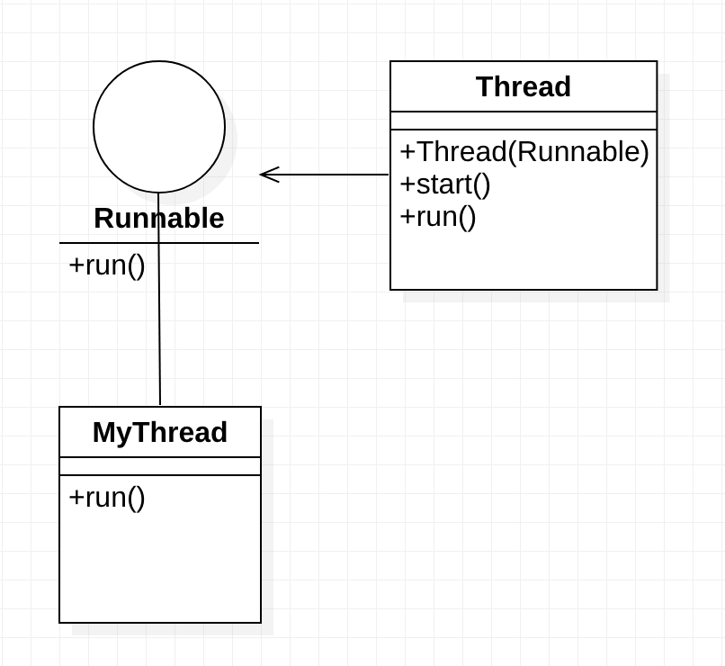
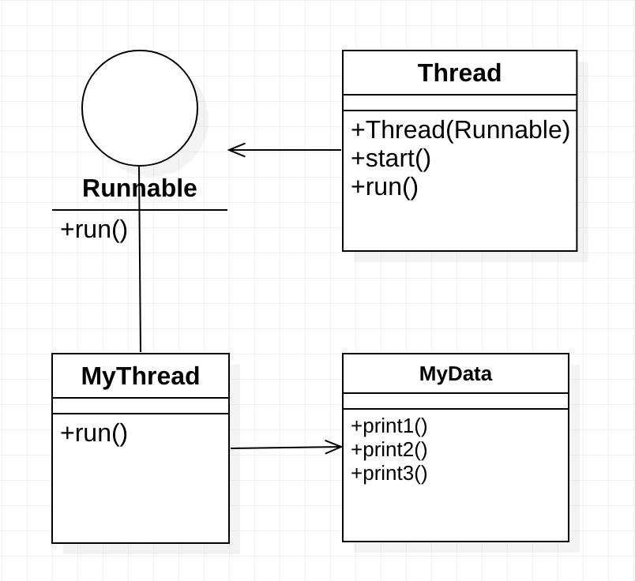

# 180914

알고리즘, SQL은 꾸준히 공부하기

`Connection`, `PreparedStatement`, `ResultSet`의 개념이 뭔지는 이해하고 있어야 하나, 현업에서는 다른 라이브러리를 사용한다.

## Thread

각각의 프로세스들은 메모리 위에 올라가 있다. JVM도 프로세스.

하나의 프로세스 안에서, 동시에 움직이는 단위를 **Thread**라고 한다.

JVM이 하나의 프로세스이므로, Java는 그 안에서 여러 thread를 사용하는 방식이다.

각각의 thread들은 하나의 프로세스 자원들을 나눠서 쓴다.

`main` 메소드가 실행되면, 무조건 main thread가 실행된다.

### Thread를 만드는 방법



`Thread`라는 클래스는 `run()`과 `start()`라는 메소드들을 갖고 있다. `Thread`를 상속받는 나만의 클래스를 구현하는데, `run()`을 오버라이딩하여 하고싶은 작업을 재정의한다(main 메소드 작성하듯이).

`start()`는 thread를 실행하기 위한 준비를 수행하고, 자신의 `run()`을 호출한다. 이 때 `run()`은 자식 클래스에서 오버라이딩 되어 있으므로, 재정의한 동작이 실행된다. *(템플릿 메소드 패턴)*

`Thread t = new MyThread();` 에서 `t`로는 부모클래스인 `Thread`가 갖고 있는 메소드만 실행가능한데, `t`로는 `start()`만 실행하면 된다. 즉 Thread를 실행하기 위한 준비를 한 뒤, `run()`을 호출하면 자식 클래스에서 구현한 대로 동작하게 되는 것이다. `자식클래스.run()`과 같은 방식으로 호출하는 것이 아니다.

```java
/**
 * Thread를 상속받는 MyThread01 class를 생성하고, run()을 오버라이딩한다.
 * run()에서는 MyThread02가 필드로 갖고 있는 string을 1초마다 출력한다. (1초마다 Thread.sleep() 호출)
 * main 메소드에서 Thread의 .start()를 호출한다.
 */
public class ThreadExam01 {
    public static void main(String[] args) {
        MyThread01 m1 = new MyThread01("*");
        MyThread01 m2 = new MyThread01("-");
        MyThread01 m3 = new MyThread01("#");
        m1.start();
        m2.start();
        m3.start();
        System.out.println("main method 종료");
    }
}

class MyThread01 extends Thread {
    private String str;
    public MyThread01(String str) {
        this.str = str;
    }

    @Override
    public void run() {
        for (int i = 0; i < 5; i++) {
            System.out.print(str);
            try {
                Thread.sleep((int)(Math.random() * 1000));
            } catch (InterruptedException ex) {}
        }
    }
}
```


---

메소드가 1개만 있는 인터페이스: **Lambda Interface**라고 한다.



`Thread`를 상속받는 것보다는 `Runnable` 인터페이스를 갖도록 하는 것이 좋다. Java에서는 단일상속만 가능하므로, `Runnable` 인터페이스를 구현하는 방식을 사용하면 나중에 다른 클래스를 상속받을 수 있는 기회가 남아있는 것이다.

`Runnable` 인터페이스에는 `run()` 메소드가 선언되어 있는데, `Runnable`을 구현한 클래스에서 이것을 오버라이딩한다. 그런데 `start()` 메소드는 `Runnable` 인터페이스에 없으므로, `Thread` 클래스가 `Runnable` 인터페이스를 갖도록 한 뒤 `Thread`의 객체에서 `.start()`를 호출한다. Thread의 생성자의 매개변수에 `Runnable` 인터페이스를 구현한 클래스의 객체를 넣어주면, `"Thread객체".start()`가 호출될 때 해당 객체에서 재정의한 `run()`이 실행된다.

```java
/**
 * Runnable interface를 구현한 MyThread02 class를 생성하고, 
 * Thread class가 MyThread02를 갖도록 한다.
 * run()에서는 MyThread02가 필드로 갖고 있는 string을 1초마다 출력한다. (Thread가 1초동안 sleep)
 */
public class ThreadExam02 {
    public static void main(String[] args) {
        MyThread02 m1 = new MyThread02("*");
        MyThread02 m2 = new MyThread02("#");
        MyThread02 m3 = new MyThread02("&");
        Thread t1 = new Thread(m1);
        Thread t2 = new Thread(m2);
        Thread t3 = new Thread(m3);
        t1.start();
        t2.start();
        t3.start();
        System.out.println("main 메소드 종료");
    }
}

class MyThread02 implements Runnable {
    private String str;

    public MyThread02(String str) {
        this.str = str;
    }

    @Override
    public void run() {
        for(int i = 0; i < 5; i++) {
            System.out.print(str);
            try {
                Thread.sleep((int)(Math.random() * 1000));
            } catch (InterruptedException ie) {}
        }
    }
}
```

Java 프로그램이 종료되는 것은 main 메소드가 종료될 때가 아니라, 모든 thread가 종료될 때이다.

<br>



```java
/**
 * Thread를 상속받는 MyThread03 class를 생성하고, run()을 오버라이딩한다.
 * MyThread03은 flag(int)와, MyData라는 공유 객체를 갖는다.
 * MyData class는 print1, print2, print3 메소드만 갖는다.
 * run()에서는 MyThread03의 flag 값에 따라 MyData의 각각 다른 print()를 호출한다.
 * 3개의 print()에 각각 synchronized 키워드를 붙여본다.
 * main 메소드에서 Thread의 .start()를 호출한다.
 */
public class ThreadExam03 {
    public static void main(String[] args) {
        MyData myData = new MyData();
        Thread t1 = new Thread(new MyThread03(1, myData));
        Thread t2 = new Thread(new MyThread03(2, myData));
        Thread t3 = new Thread(new MyThread03(3, myData));
        t1.start();
        t2.start();
        t3.start();
    }
}

class MyThread03 implements Runnable {
    private int flag;
    private MyData myData;

    public MyThread03(int flag, MyData myData) {
        this.flag = flag;
        this.myData = myData;
    }

    @Override
    public void run() {
        if (flag == 1)  myData.print1();
        else if (flag == 2)  myData.print2();
        else if (flag == 3)  myData.print3();
    }
}

class MyData {
    public void print1() {
        for (int i = 0; i < 5; i++) {
            System.out.print("#");
            try {
                Thread.sleep((long)(Math.random() * 1000));
            } catch (InterruptedException ie) {}
        }
    }
    public synchronized void print2() {
        for (int i = 0; i < 5; i++) {
            System.out.print("&");
            try {
                Thread.sleep((long)(Math.random() * 1000));
            } catch (InterruptedException ie) {}
        }
    }
    public synchronized void print3() {
        for (int i = 0; i < 5; i++) {
            System.out.print("-");
            try {
                Thread.sleep((long)(Math.random() * 1000));
            } catch (InterruptedException ie) {}
        }
    }
}
```

**공유 객체**: 여러 thread가 하나의 객체를 공유한다.

공유 객체를 갖도록 하려면 생성자 혹은 setter에 넣어주면 된다.

`synchronized`가 붙은 것끼리는 동시에 실행되지 않는다. 공유 객체가 아니라면 각자의 필드값을 쓸 것이므로 `synchronized`를 붙일 필요가 없을 것이다.

다른 사람이 작업해놓은 thread가 내가 만든 객체를 공유 객체로 사용할 수도 있다. 그럴 때에 대비해서 `synchronized` 키워드를 적절히 쓸 줄 알아야 한다. 그래야 데이터의 일관성을 유지할 수 있다.

thread 환경에서도 잘 동작하는 객체를 **thread-safe**한 객체라고 부른다. Map이나 List 등을 thread-safe하게 만드는 방법은 Collections 클래스를 활용하는 것이다.

<br>

`Runnable` 인터페이스를 구현하는 클래스의 객체를 Thread 생성자의 매개변수로 넣을 수도 있지만, 해당 객체를 일회용으로만 써도 되는 경우에는 익명 객체를 생성할 수도 있다.

```java
public class ThreadExam04 {
    public static void main(String[] args) {
        // 이름 없는 클래스. new A(){ ... }
        // A를 상속받거나, 구현하는 이름 없는 객체를 생성한다.
        Runnable runnable = new Runnable() {
            @Override
            public void run() {
                for(int i = 0; i < 50; i++){
                    System.out.print("*");
                }
            }
        };

        Thread t1 = new Thread(runnable);
        t1.start();
    }
}
```

<br>

```java
public class ThreadExam05 {
    public static void main(String[] args) {
        Thread t = new Thread(new Runnable() {
            @Override
            public void run() {
                for(int i = 0; i < 50; i++){
                    System.out.print("*");
                }
            }
        });
        t.start();
    }
}
```

<br>

Lambda를 이용하면 다음과 같이 간결하게 표현할 수 있다.

```java
public class ThreadExam06 {
    public static void main(String[] args) {
        Thread t = new Thread(() -> {
            for(int i = 0; i < 50; i++){
                System.out.print("*");
            }
        });
        t.start();
    }
}
```

`Runnable` 인터페이스는 Lambda Interface이므로, 람다 내부의 for문은 overriding된 `run()` 안에 있는 것으로 해석된다.

※ <u>Thread는 `Runnable` 인터페이스가 들어온다는 것을 어떻게 아는가?</u>  
[Thread (Java Platform SE 8 ) - Oracle Docs](https://docs.oracle.com/javase/8/docs/api/java/lang/Thread.html)를 보면, `Thread`의 생성자는 8개가 있는데 기본적으로 Runnable을 받는 것으로 되어있다. 따라서 람다식에서 Runnable을 명시하지 않아도 자동으로 인식하는 것으로 보인다.

---

<br><br>

## 앞으로 하게 될 것

#### 기본

- Java 8 기본
- HTTP
- <u>간단한 미니 웹서버 만들기</u> (네트워크 프로그래밍, thread 활용) —> 객체지향, HTTP 이해
- Servlet(동작 원리, 주요 객체 등) / JSP(JSTL, EL)
- SQL, XML, JSON는 미리 공부 해놓기
- JDBC (DB 프로그래밍)

#### 응용

- 프레임웤(반제품): Spring  
  Spring Core  
  Spring MVC  
  Spring data(JPA)  
  JDBC  
  Spring Security
- <u>게시판 만들기</u>: 웹 프로그래밍의 기본  
  게시판 자유자재로 만들 수 있으면 위의 내용들을 다 이해했다고 볼 수 있다.
- Spring Boot  
  Spring을 먼저 이해해야 한다. 다만 신입에게 필수로 요구하지는 않는다.

#### 3개월 프로젝트

- 1달 간 개발해서 실제 서비스할 수 있는 결과물 만들고, 피드백 받고 수정해보기.  
  실제 운영할 수 있는 서비스를 목표로.

<u>뭐든지 이론만 공부하지 말고 실제로 꼭 구현해 보기</u>