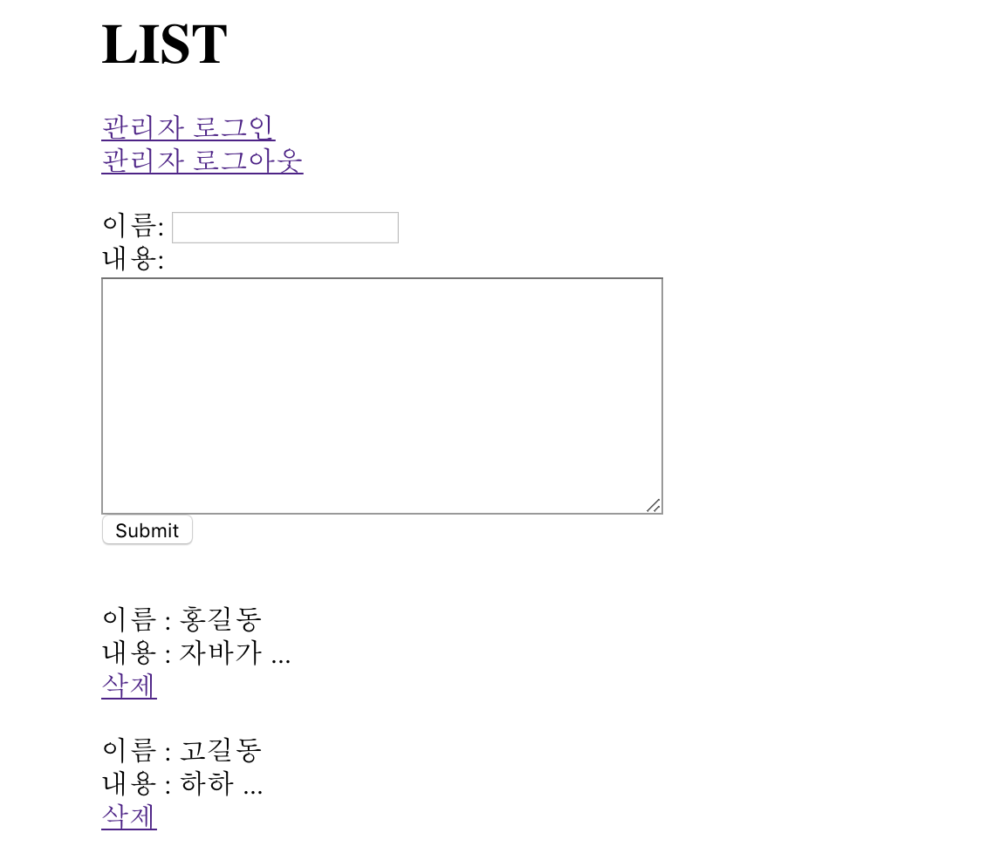

# 181002

## 간단한 방명록 만들기



위와 같은 형태의 간단한 방명록 모형을 만든다. DB에 데이터를 저장하지 않고, 각 버튼을 눌렀을 때 요청 메소드(GET / POST)에 따라 redirect와 forward를 수행하여 특정 URL로 이동하도록 한다.

- 첫 화면: "/guestbook/list"로 GET 요청하면, `GuestbookListServlet`이 요청을 받아 "/WEB-INF/views/list.jsp"로 forwarding한다.

- 관리자 로그인 링크를 누르면 "/guestbook/login"로 GET 요청한다. 해당 요청을 `GuestbookLoginServlet`이 받아 "/WEB-INF/views/login.jsp"로 forwarding한다.
- `login.jsp`는 암호 입력 form을 갖고 있으며, 암호를 "/guestbook/login"으로 POST로 보낸다.
- POST 요청을 받은 `GuestbookLoginServlet`에서는 password를 콘솔에 출력하고, "/guestbook/list"로 redirect 명령을 내린다(302 응답을 보낸다).
- 관리자 로그아웃 링크를 누르면 "/guestbook/logout"으로 GET 요청한다. 해당 요청을 `GuestbookLogoutServlet`이 받아 "/guestbook/list"로 redirect 명령을 내린다.
- 작성자 이름과 글 내용을 제출하면 "/guestbook/write"로 POST 요청한다. 해당 `GuestbookWriteServlet`이 받아 작성자 이름과 글 내용을 콘솔에 출력하고 "/guestbook/list"로 redirect 명령을 내린다.
- 글의 삭제 링크를 누르면 "/guestbook/delete?num=1"으로 GET 요청한다. 해당 요청을 `GuestbookDeleteServlet`이 받아 Query String Parameter(각 글의 id)를 콘솔에 출력하고, "/guestbook/list"로 redirect 명령을 내린다.

```java
/*** GuestbookListServlet.java ***/

package my.examples.guestbook.servlet;

import javax.servlet.RequestDispatcher;
import javax.servlet.ServletException;
import javax.servlet.annotation.WebServlet;
import javax.servlet.http.HttpServlet;
import javax.servlet.http.HttpServletRequest;
import javax.servlet.http.HttpServletResponse;
import java.io.IOException;

@WebServlet("/guestbook/list")
public class GuestBookListServlet extends HttpServlet {
    protected void doGet(HttpServletRequest request, HttpServletResponse response) throws ServletException, IOException {
        RequestDispatcher dispatcher = request.getRequestDispatcher("/WEB-INF/views/list.jsp");
        dispatcher.forward(request, response);
    }
}
```

```jsp
<%-- list.jsp --%>
<html>
<head>
    <title>LIST</title>
</head>
<body style="margin: 40px 300px;">
    <h1>LIST</h1>

    <a href="/guestbook/login">관리자 로그인</a><br>
    <a href="/guestbook/logout">관리자 로그아웃</a>
    <br><br>

    <form method="POST" action="/guestbook/write">
        이름: <input type="name" name="name"><br>
        내용: <br>
        <textarea name="content" id="content" rows="10" cols="50"></textarea><br>
        <input type="submit">
    </form><br>

    <%-- 방명록 목록을 출력한다. --%>
    이름 : 홍길동 <br>
    내용 : 자바가 ... <br>
    <a href="/guestbook/delete?num=1">삭제</a><br><br>
    이름 : 고길동 <br>
    내용 : 하하  ... <br>
    <a href="/guestbook/delete?num=2">삭제</a><br>
</body>
</html>
```

```java
/*** GuestbookLoginServlet.java ***/

package my.examples.guestbook.servlet;

import javax.servlet.RequestDispatcher;
import javax.servlet.ServletException;
import javax.servlet.annotation.WebServlet;
import javax.servlet.http.HttpServlet;
import javax.servlet.http.HttpServletRequest;
import javax.servlet.http.HttpServletResponse;
import java.io.IOException;

@WebServlet("/guestbook/login")
public class GuestBookLoginServlet extends HttpServlet {
    protected void doGet(HttpServletRequest request, HttpServletResponse response) throws ServletException, IOException {
        RequestDispatcher dispatcher = request.getRequestDispatcher("/WEB-INF/views/login.jsp");
        dispatcher.forward(request, response);
    }

    @Override
    protected void doPost(HttpServletRequest req, HttpServletResponse resp) throws ServletException, IOException {
        String password = req.getParameter("password");
        System.out.println("password: " + password);

        resp.sendRedirect("/guestbook/list");
    }
}
```

```jsp
<%-- login.jsp --%>
<%@ page contentType="text/html;charset=UTF-8" language="java" %>
<html>
    <head>
        <title>LOG IN</title>
    </head>

    <body>
        <h1>관리자 로그인 페이지입니다.</h1><br>
        <form method="POST" action="/guestbook/login">
            암호: <input type="password" name="password"><br>
            <input type="submit">
        </form>
    </body>
</html>

```

```java
/*** GuestbookLogoutServlet.java ***/

package my.examples.guestbook.servlet;

import javax.servlet.RequestDispatcher;
import javax.servlet.ServletException;
import javax.servlet.annotation.WebServlet;
import javax.servlet.http.HttpServlet;
import javax.servlet.http.HttpServletRequest;
import javax.servlet.http.HttpServletResponse;
import java.io.IOException;

@WebServlet("/guestbook/logout")
public class GuestBookLogoutServlet extends HttpServlet {
    protected void doGet(HttpServletRequest request, HttpServletResponse response) throws ServletException, IOException {
        response.sendRedirect("/guestbook/list");
    }
}
```

```java
/*** GuestbookWriteServlet.java ***/

package my.examples.guestbook.servlet;

import javax.servlet.RequestDispatcher;
import javax.servlet.ServletException;
import javax.servlet.annotation.WebServlet;
import javax.servlet.http.HttpServlet;
import javax.servlet.http.HttpServletRequest;
import javax.servlet.http.HttpServletResponse;
import java.io.IOException;

@WebServlet("/guestbook/write")
public class GuestBookWriteServlet extends HttpServlet {
    @Override
    protected void doPost(HttpServletRequest req, HttpServletResponse resp) throws ServletException, IOException {
        String name = req.getParameter("name");
        String content = req.getParameter("content");
        System.out.println("name: " + name + ", content: " + content);

        resp.sendRedirect("/guestbook/list");
    }
}
```

```java
/*** GuestbookDeleteServlet.java ***/

package my.examples.guestbook.servlet;

import javax.servlet.RequestDispatcher;
import javax.servlet.ServletException;
import javax.servlet.annotation.WebServlet;
import javax.servlet.http.HttpServlet;
import javax.servlet.http.HttpServletRequest;
import javax.servlet.http.HttpServletResponse;
import java.io.IOException;

@WebServlet("/guestbook/delete")
public class GuestBookDeleteServlet extends HttpServlet {
    protected void doGet(HttpServletRequest request, HttpServletResponse response) throws ServletException, IOException {
        String id = request.getParameter("num");
        System.out.println("id: " + id);

        response.sendRedirect("/guestbook/list");
    }
}
```

<br>

forwarding한다는 사실은 브라우저는 알지 못한다. Servlet이 하는 것이다.

웹프로그래밍 하기 전: URL에 대한 기획하기(PathVariable, 파라미터 등), URL마다 어떤 것을 보여줄 것인가(단 redirect는 내용을 보여 주지는 않는다.)  
웹프로그래밍에서 URL 설계가 매우 중요하다.

게시판: CMS(Contents Management System)

예제 사이트: [Inven WOW](http://wow.inven.co.kr/), [Inven LOL](http://lol.inven.co.kr/) 참고(path 확인). AJAX 같은 복잡한 방식 없어서 공부하기 좋음.

---

## HW

- 일단 PathVariable 말고 path, parameter 조작 해보기
- form 태그 내의 파라미터 읽어들이는 연습("`Servlet parameter` 검색")  
  Checkbox, Selectbox: `request.getParameterValues()`
- forward와 redirect의 차이점  
  - Tistory 정리내용: [Redirect](http://starkying.tistory.com/28?category=665008) | [Forward, 그리고 Servlet & JSP의 연동](http://starkying.tistory.com/29?category=665008) 참고
- URL, 네비게이션, 방명록 + **게시판** 형태 구현해보기

<br>

- DAO, VO, DTO 개념 이해하기
  - **DAO**(Data Access Object): 데이터에 접근을 위한 객체. 즉 데이터베이스를 사용해 데이터를 조회하거나 조작하는 기능을 전담하도록 만든 객체. 효율적인 커넥션 관리와 보안성 때문에 사용한다.
  - **VO**(Value Object): RDBMS의 레코드에 대응되는 자바 클래스. VO는 값 오브젝트로써 값을 위해 쓰인다. 자바는 값 타입을 표현하기 위해 불변 클래스를 만들어서 사용하는데, 불변이라는 것은 readOnly 특징을 가집니다.
  - **DTO**(Data Transfer Object): 데이터가 포함된 객체를 한 시스템에서 다른 시스템으로 전달하는 작업을 처리하는 객체.

- EL / JSTL 공부하기
  - Tistory 정리내용: [EL(Expression Language)과 JSTL(JSP Standard Tag Library)](http://starkying.tistory.com/31
    ) 참고