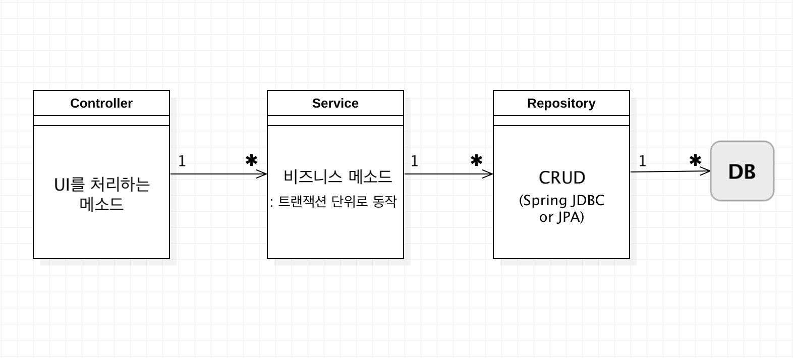

# 181022

트랜잭션의 시작은 메소드 시작 부분, 끝은 commit이나 rollback  
RuntimeException이 발생했을 때만 **rollback**  
Exception이 발생하지 않으면 **commit**

Service 내부 > 비즈니스 객체 > 비즈니스 메소드

​	- 비즈니스 메소드: 기획 단계에서 도출된 기능들(ex. 게시판 조회 기능) 

### DataSource

- Interface ***PlatformTransactionManager***  
  Spring에서 트랜잭션 처리를 수행할 때, PlatformTransactionManager(를 구현한) 객체가 내부적으로 사용된다.

  트랜잭션 처리를 하려면 DB Config 파일의 클래스명 위에 `@EnableTransactionManagement`를 붙여야 한다. 이를 통해 트랜잭션 처리를 위한 AOP 적용을 수행한다. 즉 `@EnableTransactionManagement` annotation을 붙이지 않으면 트랜잭션 처리를 할 수 없다.

  트랜잭션을 적용하고자 하는 메소드(혹은 클래스, 인터페이스 등)에 `@Transactional` annotation을 붙인다. 읽기만을 수행하는 트랜잭션 메소드에는 readOnly(기본값은 false)를 true로 지정한다. (`@Transactional(readOnly = true)`)

  PlatformTransactionManager는 DataSource를 갖는다.

- Interface ***DataSource***

  DataSource는 인터페이스이며, 이를 구현하는 객체가 필요한데 이러한 객체에는 <u>Commons DBCP, HikariCP</u> 등이 있다. 

  DataSource에서 <u>Connection 생성</u>(DataSource가 Connection 인터페이스를 사용, 즉 의존한다)이 이루어지며, 또한 <u>DB와의 연결 획득</u>과 <u>트랜잭션 처리</u>(commit, rollback) 및 <u>connection pool을 사용하기 위해서</u>도 사용되는 인터페이스라고 생각하면 된다.  
  (<a href="https://docs.oracle.com/javase/8/docs/api/java/sql/Connection.html" target="_blank">Java Connection API</a> 참조. `commit()`, `rollback()` 등의 메소드를 갖고 있다.)

  connection pool은 Connection들을 미리 연결해서 가지고 있는 객체이다. 미리 Connection을 연결해 놓는 이유는 Connection을 연결할 때 비용이 많이 발생하기 때문이다. DB에서 데이터를 가져오는 것 보다 Connection 연결할 때 더 많은 비용이 발생한다.

  특히 웹 서비스에서는 connection pool에 Connection이 부족해지면 동시에 발생되는 여러 요청에 대응할 수 없게 되므로, connection을 사용하면 바로 바로 close(반납)해줘야 한다.

- Connection을 빨리 되돌려주려면?

  - Slow SQL을 제거한다.
  - 과도하게 많은 SQL이 사용되면 안된다. (비즈니스 메소드가 과도하게 자주 호출된다던지)
  - DB에는 과도한 Connection을 연결할 수 없다. 적절히 조정할 필요가 있다.  
    connection pool 내부 Connection의 개수(최소값, 최대값, 초기값)를 항상 같게 하는 것이 좋다. 

---

### Spring JDBC

내부적으로 < *JDBC + Java Reflection* >이 사용된다.  
편리함을 위해 사용하는 것이므로, 너무 원리에 파고들기 보다는 **사용법** 위주로 익숙해지려고 노력하자. 

- Spring JDBC에서 가장 핵심은 <u>JdbcTemplate</u> (입력, 수정, 삭제, 조회)
- `NamedParameterJdbcTemplate`: JdbcTemplate을 좀 더 편하게 사용할 수 있도록 하는 클래스
- JDBC의 지루하고 반복적인 코드를 줄여주는 기능을 가지고 있다. 

- INSERT, UPDATE, DELETE, SELECT  
  사용자는 SQL을 작성하고, 해당 SQL에 바인딩할 객체(보통 `Map` 사용)를 설정한다.
- SELECT  
  SELECT한 결과를 DTO에 담아주는 기능 — Mapper

---

### DAO 만드는 방법

- `@Repository` annotation을 붙인다.
- field로 JdbcTemplate(+ SimpleJdbcInsert)가 선언된다.

- `NamedParameterJdbcTemplate`은 `?` 대신에 이름(ex. `:id`, `:name`)을 사용할 수 있도록 한다.

- 생성자에서 DataSource를 주입받아서 JdbcTemplate을 초기화 한다.
- JdbcTemplate 메소드에는 `update()`, `queryForObject()`, `query()` 등이 있다.
- 경우에 따라서는 INSERT를 위해 생성자에서 `SimpleJdbcInsert`를 초기화 한다.

- `SimpleJdbcInsert객체.execute()`에는 Map이나 SqlParameterSource 객체가 들어간다.  
  `executeAndReturnKey()`는 insert한 후 해당 row의 id를 리턴한다.

- 1건 혹은 null을 조회할 때: `jdbc.queryForObject(sql, paramMap, rowMapper)`
- param은 바인딩할 Map이며(—> `?` 대신 이름 사용 가능), Map 바인딩 정보를 반영하여 SQL을 실행하고, 실행한 결과를 rowMapper를 이용해 DTO에 담아서 리턴한다.  
  rowMapper는 ResultSet과 유사하다. 값(칼럼)을 DTO에 담아주는 규칙. 
- `List<>` 형태의 여러 값을 읽어오기 위해서는 `query(sql, paramMap, rowMapper)`를 사용한다.

---

## HW

- 회원정보를 저장하는 테이블(member)을 만든다.  
  - id(자동생성), name, email, password, regdate(등록일)
- <u>Member</u>: 저장, email에 해당하는 회원정보 조회
- <u>Board</u>: start부터 limit만큼 목록 가져오기
- DAO, Service 

- Connection Pool에 어떤 설정들을 할 수 있는지 공부하기
  - 

