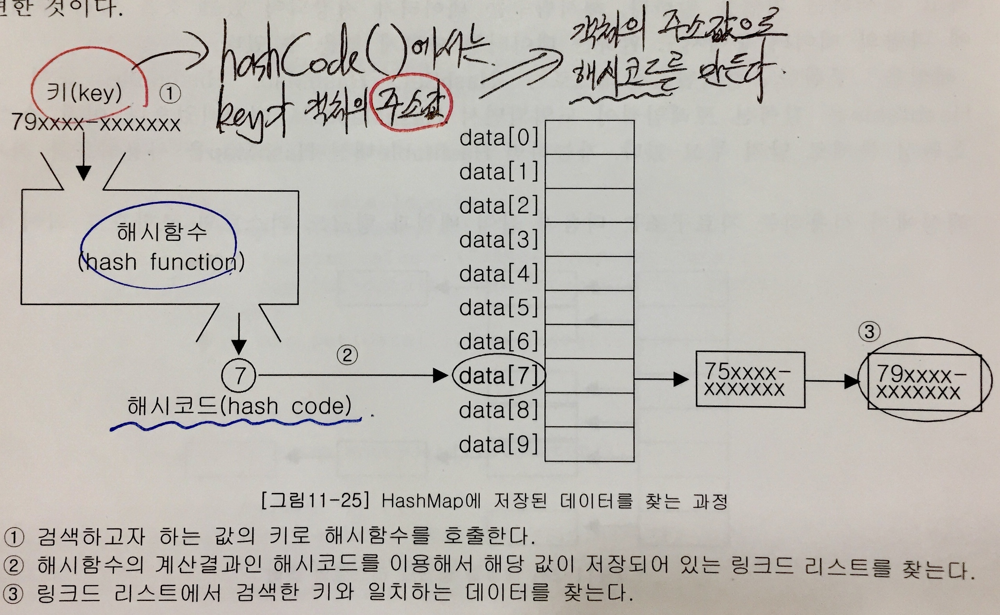
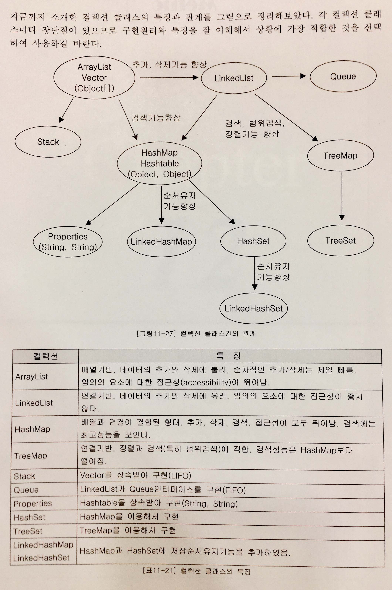

# Collection Framework 정리

Collection Framework이란, 'data group(데이터 군)'을 다루고 표현하기 위한 단일화된 구조(architecture)이다. Collection은 다수의 데이터, 즉 데이터 그룹을 의미한다.

JDK 1.2부터 Collection Framework이 추가되면서, 다양한 종류의 collection 클래스가 추가되고 모든 collection 클래스들을 표준화된 방식으로 다룰 수 있도록 체계화 되었다.

##### 장점

- 인터페이스와 다형성을 이용한 객체지향적 설계를 통한 표준화
- 사용법을 익히기 편리하다.
- 재사용성이 높은 코드를 작성할 수 있다.


## 1. Collection Framework의 핵심 인터페이스

Collection Framework에서는 collection(데이터 그룹)을 크게 3가지 타입이 존재한다고 가정하고, List, Set, Map의 3가지 인터페이스를 정의하였다.


- **List**: 순서가 있는 데이터의 집합. 데이터의 중복을 허용한다  
  예) 대기자 명단  
  구현 클래스: ArrayList, LinkedList, Stack*(deprecated)*, Vector*(deprecated)*
- **Set**: 순서를 유지하지 않는 데이터의 집합. 데이터의 중복을 허용하지 않는다.  
  예) 양의 정수집합, 소수의 집합  
  구현 클래스: HashSet, TreeSet
- **Map**: key-value 쌍으로 이루어진 데이터의 집합.  
  순서는 유지되지 않으며, 키는 중복을 허용하지 않고, 값은 중복을 허용한다.  
  구현 클래스: HashMap, TreeMap, Hashtable*(deprecated)*, Properties*(deprecated)*

실제 개발 시 다루고자 하는 collection의 특징을 파악하고, 어떤 인터페이스를 구현한 collection 클래스를 사용할지 결정해야 한다.

Stack, Vector, Hashtable, Properties 클래스들은 Collection Framework 이전부터 존재하던 것으로, Collection Framework의 명명법을 따르지 않으므로 가급적 사용하지 않는 것이 좋다.

### Collection 인터페이스

List와 Set의 조상.

collection 클래스에 저장된 데이터를 읽고, 추가하고 삭제하는 등 collection을 다루는 데 가장 기본적인 메소드들을 정의하고 있다.

| Method                                                       | 설명                                                         |
| ------------------------------------------------------------ | ------------------------------------------------------------ |
| boolean add(Object o)<br />boolean addAll(Collection<? extends E> c) | 지정된 객체(o) 또는 Collection(c)의 객체들을 <br />collection에 추가한다. |
| void clear()                                                 | collection의 모든 객체를 삭제한다.                           |
| boolean contains(Object o)<br />boolean containsAll(Collection<?> c) | 지정된 객체(o) 또는 Collection(c)의 객체들이 <br />collection에 포함되어 있는지 확인한다. |
| boolean equals(Object o)                                     | 동일한 collection인지 비교한다.                              |
| int hashCode()                                               | collection의 hash code를 리턴한다.                           |
| boolean isEmpty()                                            | collection이 비어있는지 확인한다.                            |
| Iterator<E> iterator()                                       | collection의 Iterator를 얻어서 리턴한다.                     |
| boolean remove(Object o)                                     | 지정된 객체를 삭제한다.                                      |
| boolean removeAll(Collection<?> c)                           | 지정된 collection에 포함된 객체들을 삭제한다.                |
| boolean retainAll(Collection<?> c)                           | 지정된 collection에 포함된 객체만을 남기고 <br />다른 객체들은 collection에서 삭제한다. <br />이 작업으로 인해 collection에 변화가 있으면 true, <br />그렇지 않으면 false를 리턴한다. |

*(E, T, K, V 등은 모두 Object를 나타냄.)*

### List 인터페이스

중복을 허용, 저장순서가 유지됨.


| Method                                                       | 설명                                                         |
| ------------------------------------------------------------ | ------------------------------------------------------------ |
| void add(int index, E element)<br />boolean addAll(int index, Collection<? extends E> c) | 지정된 위치(index)에 객체(element) 또는 <br />collection에 포함된 객체들을 추가한다. |
| E get(int index)                                             | 지정된 위치(index)에 있는 객체를 리턴한다.                   |
| int indexOf(Object o)                                        | 지정된 객체의 위치(index)를 리턴한다.<br />(List의 첫번째 요소부터 순방향으로 찾는다.) |
| int lastIndexOf(Object o)                                    | 지정된 객체의 위치(index)를 리턴한다.<br />(List의 첫번째 요소부터 역방향으로 찾는다.) |
| ListIterator<E> listIterator()<br />ListIterator<E> listIterator(int index) | List의 객체에 접근할 수 있는 ListIterator를 리턴한다.        |
| E remove(int index)                                          | 지정된 위치(index)에 있는 객체를 삭제하고 <br />삭제된 객체를 리턴한다. |
| E set(int index, Object element)                             | 지정된 위치(index)에 객체(element)를 저장한다.               |
| void sort(Comparator<? super E> c)                           | 지정된 비교자(comparator)로 List를 정렬한다.                 |
| List<E> subList(int fromIndex, int toIndex)                  | 지정된 범위(fromIndex~toIndex)에 있는 <br />객체를 리턴한다. |

### Set 인터페이스

중복을 허용하지 않고, 저장순서가 유지되지 않는다.


### Map 인터페이스

key-value 쌍으로 묶어서 저장. 키는 중복될 수 없지만, 값은 중복을 허용한다.  
중복된 키와 값을 저장하면, 기존의 값은 없어지고 마지막에 저장된 값이 남게 된다.


| Method                                      | 설명                                                         |
| ------------------------------------------- | ------------------------------------------------------------ |
| void clear()                                | Map의 모든 객체를 삭제한다.                                  |
| boolean containsKey(Object key)             | 지정된 key 객체와 일치하는 Map의 key 객체가 있는지 확인한다. |
| boolean containsValue(Object value)         | 지정된 value 객체와 일치하는 Map의 <br />value 객체가 있는지 확인한다. |
| Set<Map.Entry<K, V>> entrySet()             | Map에 저장되어 있는 key-value 쌍을 <br />Map.Entry 타입의 객체로 저장한 Set으로 리턴한다. |
| boolean equals(Object o)                    | 동일한 Map인지 비교한다.                                     |
| V get(Object key)                           | 지정한 key 객체에 대응하는 value 객체를 찾아서 리턴한다.     |
| int hashCode()                              | 해시코드를 리턴한다.                                         |
| boolean isEmpty()                           | Map이 비어있는지 확인한다.                                   |
| Set<K> keySet()                             | Map에 저장된 모든 key 객체를 리턴한다.                       |
| V put(K key, V value)                       | Map에 value 객체를 key 객체에 연결(mapping)하여 저장한다.    |
| void putAll(Map<? extends K,? extends V> m) | 지정된 Map의 모든 key-value 쌍을 추가한다.                   |
| V remove(Object key)                        | 지정한 key 객체와 일치하는 key-value 객체를 삭제한다.        |
| int size()                                  | Map에 저장된 key-value 쌍의 개수를 리턴한다.                 |
| Collection<V> values()                      | Map에 저장된 모든 value 객체를 리턴한다.                     |

Map 인터페이스에서 key는 중복을 허용하지 않으므로 keySet()의 리턴타입은 Set이고, value는 중복을 허용하기 때문에 values()의 리턴타입은 Collection이다.

### Map.Entry 인터페이스

Map 인터페이스의 내부 인터페이스.  
Map에 저장되는 key-value 쌍을 다루기 위한 것이며, Map 인터페이스를 구현하는 클래스에서는 Map.Entry 인터페이스도 함께 구현해야 한다.

```java
public interface Map {
    ...
    interface Entry {
        Object getKey();
        Object getValue();
        Object setValue(Object value);
        boolean equals(Object o);
        int hashCode();
        ...
    }
}
```

| Method                   | 설명                                       |
| ------------------------ | ------------------------------------------ |
| boolean equals(Object o) | 동일한 Entry인지 비교한다.                 |
| K getKey()               | Entry의 key 객체를 리턴한다.               |
| V getValue()             | Entry의 value 객체를 리턴한다.             |
| int hashCode()           | Entry의 해시코드를 리턴한다.               |
| V setValue(V value)      | Entry의 value 객체를 지정된 객체로 바꾼다. |

<br/>

## 2. ArrayList

ArrayList는 List를 구현하므로 데이터의 저장순서가 유지되고 중복을 허용한다.

Object 배열을 이용해서 데이터를 순차적으로 저장한다. 따라서 모든 종류의 객체를 담을 수 있다.

Vector와 구현원리 및 기능적인 측면에서 동일하지만, 가급적 ~~Vector~~보다는 ArrayList를 사용하자.

| Method                                                | 설명                                                         |
| ----------------------------------------------------- | ------------------------------------------------------------ |
| ArrayList()                                           | 크기가 0인 ArrayList를 생성                                  |
| ArrayList(Collection<? extends E> c)                  | 주어진 collection이 저장된 ArrayList를 생성                  |
| ArrayList(int initialCapacity)                        | 지정된 초기용량을 갖는 ArrayList를 생성                      |
| ArrayList(int initialCapacity, int capacityIncrement) | 지정된 초기용량과 용량의 증분을 갖는 ArrayList를 생성        |
| boolean add(E e)                                      | ArrayList의 마지막에 객체를 추가. 성공여부를 리턴            |
| void add(int index, E element)                        | 지정된 위치(index)에 객체를 저장                             |
| boolean addAll(Collection<? extends E> c)             | 주어진 collection의 모든 객체를 저장한다.                    |
| boolean addAll(int index, Collection<? extends E> c)  | 지정된 위치(index)부터 주어진 collection의 <br />모든 객체를 저장한다. |
| void clear()                                          | ArrayList를 완전히 비운다.                                   |
| Object clone()                                        | ArrayList를 복제한다.                                        |
| boolean contains(Object o)                            | 지정된 객체(o)가 ArrayList에 포함되어 있는지 확인            |
| void ensureCapacity(int minCapacity)                  | ArrayList의 용량이 최소한 minCapacity가 되도록 한다.         |
| E get(int index)                                      | 지정된 위치(index)에 저장된 객체를 리턴한다.                 |
| int indexOf(Object o)                                 | 지정된 객체가 저장된 위치를 찾아 리턴한다.                   |
| boolean isEmpty()                                     | ArrayList가 비어있는지 확인한다.                             |
| Iterator<E> iterator()                                | ArrayList의 Iterator 객체를 리턴                             |
| int lastIndexOf(Object o)                             | 객체(o)가 저장된 위치를 끝부터 역방향으로 검색해서 리턴      |
| listIterator<E> listIterator()                        | ArrayList의 ListIterator를 리턴                              |
| listIterator<E> listIterator(int index)               | ArrayList의 지정된 위치부터 시작하는 ListIterator를 <br />리턴 |
| E remove(int index)                                   | 지정된 위치(index)에 있는 객체를 제거한다.                   |
| boolean remove(Object o)                              | 지정한 객체를 제거한다. 성공여부를 리턴                      |
| boolean removeAll(Collection<?> c)                    | 지정한 collection에 저장된 것과 동일한 객체들을 <br />ArrayList에서 제거한다. |
| boolean retainAll(Collection<?> c)                    | ArrayList에 저장된 객체 중에서 주어진 collection과 <br />공통된 것들만을 남기고 나머지는 삭제한다. |
| E set(int index, E element)                           | 주어진 객체(element)를 지정된 위치(index)에 저장한다.        |
| int size()                                            | ArrayList에 저장된 객체의 개수를 반환한다.                   |
| void sort(Comparator<? super E> c)                    | 지정된 정렬 기준(c)으로 ArrayList를 정렬                     |
| List<E> subList(int fromIndex, int toIndex)           | fromIndex부터 toIndex 사이에 저장된 객체를 리턴한다.         |
| Object[] toArray()                                    | ArrayList에 저장된 모든 객체들을 객체배열로 리턴한다.        |
| <T> T[] toArray(T[] a)                                | ArrayList에 저장된 모든 객체들을 객체배열 a에 담아 <br />리턴한다. |
| void trimToSize()                                     | 용량을 크기에 맞게 줄인다. (빈 공간을 없앤다.)               |

```java
import java.util.ArrayList;

public class Main {

    public static void main(String[] args) {
        ArrayList list1 = new ArrayList(10);
        list1.add(new Integer(5));
        list1.add(new Integer(4));
        list1.add(new Integer(2));
        list1.add(new Integer(0));
        list1.add(new Integer(1));
        list1.add(new Integer(3));

        ArrayList list2 = new ArrayList(list1.subList(1, 4));
        print(list1, list2);

        System.out.println("list1.containsAll(list2): " + list1.containsAll(list2));

        list2.add("B");
        list2.add("C");
        list2.add(3, "A");
        print(list1, list2);

        list2.set(3, "AA");
        print(list1, list2);

        System.out.println("list1.retainAll(list2): " + list1.retainAll(list2));
        print(list1, list2);

        for (int i = list2.size() - 1; i >= 0; i--) {
            if (list1.contains(list2.get(i)))
                list2.remove(i);
        }
        print(list1, list2);
    }

    static void print(ArrayList list1, ArrayList list2) {
        System.out.println("list1: " + list1);
        System.out.println("list2: " + list2);
        System.out.println();
    }
}
```

위의 코드에서 main 메소드 하단의 for문을 보면, list2에 list1과 공통되는 요소가 있을 경우 그 요소를 삭제하기 위해 list2에 대한 index를 마지막 위치부터 왼쪽으로 이동하면서 순회하고 있다. 만약 앞에서부터 순회할 경우, i번째 요소를 삭제하면 오른쪽에 있던 요소들이 왼쪽으로 전부 자리이동을 하게 되므로 정상적인 삭제가 이뤄지지 않는다.

ArrayList나 Vector와 같이 배열을 이용한 자료구조는 데이터를 가져오고 저장하는 것은 성능이 좋지만, 용량을 변경해야 할 경우 새로운 배열을 생성하고 값을 복사해오는 방식이므로 성능이 상당히 떨어진다. 따라서 처음 인스턴스를 생성할 때 용량을 충분하게 잡아주는 것이 좋다.

<br/>

## 3. LinkedList

Array(배열)의 단점

1. 크기를 변경할 수 없다.  
   크기를 변경하려면 resizing(새로운 배열 생성 후 데이터 copy)이 필요하다.  
   실행속도를 향상시키려면(resizing 발생하지 않도록) 배열의 크기를 충분히 크게 해야 하므로 메모리가 낭비된다.
2. 데이터의 비순차적인 추가 및 삭제에 시간이 많이 걸린다.  
   차례대로 추가하거나 마지막부터 삭제하는 것은 빠르지만, 배열의 중간에 추가하거나 삭제하는 경우 다른 데이터들을 복사해야 한다.

이러한 배열의 단점을 보완하기 위해 LinkedList가 고안되었다.

```java
class Node {
    Node next;
    Object item;
}
```

<u>삭제</u>: 삭제하고자 하는 요소의 이전 요소가 삭제하고자 하는 요소의 다음 요소를 가리키도록 변경  
<u>추가</u>: 새로운 요소를 생성하고, 추가하고자 하는 위치의 이전 요소는 새로운 요소를, 새로운 요소는 그 다음 요소를 가리키도록 변경

```java
// Double-Linked List
class Node {
    Node prev;
    Node next;
    Object item;
}
```

❖ <u>Doubly Circular Linked List</u>: Double-Linked List의 첫번째 요소와 마지막 요소를 연결  
LinkedList 클래스는 Linked List가 아닌 'Double-Linked List'로 구현되어 있음. (Linked List의 접근성 향상)

### ArrayList와 LinkedList의 성능비교

1. **순차적으로 추가/삭제하는 경우, ArrayList가 LinkedList보다 빠르다.**  
   "순차적으로": 마지막 데이터부터 역순으로 추가/삭제한다.
2. **중간 데이터를 추가/삭제하는 경우, LinkedList가 ArrayList보다 빠르다.**  
   LinkedList는 각 요소 간의 연결만 바꿔주면 되지만, ArrayList는 각 요소들을 재배치해야 한다.

LinkedList는 n번째 요소를 찾으려면 처음부터 따라가면서 찾아야 하지만, ArrayList는 탐색에 필요한 계산이 비교적 간단하다. 따라서, **LinkedList는 저장해야 하는 데이터의 개수가 많아질 수록 access time이 길어진다.**

**size 변경이 거의 없다면 ArrayList, size가 자주 바뀐다면 LinkedList를 사용하는 것이 좋다.**

<br/>

## 4. Stack & Queue

<u>Stack</u>: FILO(First In Last Out), ArrayList로 구현하는 것이 적합  
<u>Queue</u>: FIFO(First In First Out), LinkedList로 구현하는 것이 적합

| Method               | 설명                                                         |
| -------------------- | ------------------------------------------------------------ |
| boolean empty()      | Stack이 비어있는지 알려준다.                                 |
| E peek()             | Stack의 맨 위에 저장된 객체를 리턴.<br />pop()과 달리 Stack에서 객체를 꺼내지는 않음.<br />(비어있을 경우 EmptyStackException 발생) |
| E pop()              | Stack의 맨 위에 저장된 객체를 꺼낸다.<br />(비어있을 경우 EmptyStackException 발생) |
| E push(E item)       | Stack에 객체(item)를 저장한다.                               |
| int search(Object o) | Stack에서 주어진 객체(o)를 찾아서 그 위치를 리턴.<br />못찾으면 -1을 리턴. |

*Stack의 method*

<br/>

| Method             | 설명                                                         |
| ------------------ | ------------------------------------------------------------ |
| boolean add(E e)   | 지정된 객체를 Queue에 추가한다. 성공여부를 리턴.<br />(저장공간이 부족하면 IllegalStateException 발생) |
| E element()        | 삭제없이 요소를 읽어온다. peek과 달리 Queue가 비었을 때 NoSuchElementException 발생 |
| boolean offer(E e) | Queue에 객체를 저장. 성공여부를 리턴                         |
| E peek()           | 삭제없이 요소를 읽어온다. Queue가 비어 있으면 null을 리턴    |
| E poll()           | Queue에서 객체를 꺼내서 리턴. 비어 있으면 null을 리턴        |
| E remove()         | Queue에서 객체를 꺼내 리턴. 비어 있으면 NoSuchElementException 발생 |

*Queue의 method*<br/>

Java에서는 Stack은 클래스로 구현하여 제공하고 있지만, Queue는 Queue 인터페이스로만 정의되어 있어 Queue 인터페이스를 구현한 클래스들(Queue 인터페이스 API 문서에서 "All Known Implementing Classes" 확인)을 사용해야 한다. <br/>

다음은 Stack을 활용한 예제이다(뒤로/앞으로 history).

```java
import java.util.Stack;

public class Main {
    static Stack back = new Stack();
    static Stack forward = new Stack();

    public static void main(String[] args) {
        goURL("1) https://www.google.com");
        goURL("2) https://www.facebook.com");
        goURL("3) https://www.naver.com");
        goURL("4) https://github.com");

        printStatus();

        goBack();
        System.out.println("******* 뒤로 누른 후 *******");
        printStatus();

        goBack();
        System.out.println("******* 뒤로 누른 후 *******");
        printStatus();

        goForward();
        System.out.println("******* 앞으로 누른 후 *******");
        printStatus();

        goURL("https://www.daum.net");
        System.out.println("******* 새로운 주소로 이동 후 *******");
        printStatus();
    }

    public static void printStatus() {
        System.out.println("back: " + back);
        System.out.println("forward: " + forward);
        System.out.println("현재 화면은: " + back.peek() + "입니다.");
        System.out.println();
    }

    public static void goURL(String url) {
        back.push(url);
        if (!forward.empty())
            forward.clear();
    }

    public static void goForward() {
        if (!forward.empty())
            back.push(forward.pop());
    }

    public static void goBack() {
        if (!back.empty())
            forward.push(back.pop());
    }
}
```

<br/>

다음은 Queue 인터페이스의 LinkedList를 활용한 예제이다(명령어 입력 history).

```java
import java.util.LinkedList;
import java.util.ListIterator;
import java.util.Queue;
import java.util.Scanner;

public class Main {
    static Queue q = new LinkedList();
    static final int MAX_SIZE = 5;

    public static void main(String[] args) {
        System.out.println("help를 입력하면 도움말을 볼 수 있습니다.");

        while (true) {
            System.out.println(">> ");
            try {
                Scanner s = new Scanner(System.in);
                String input = s.nextLine().trim();

                if (input.equals(""))   continue;

                if (input.equalsIgnoreCase("q")) {
                    System.out.println("종료합니다.");
                    System.exit(0);
                }
                else if (input.equalsIgnoreCase("help")) {
                    System.out.println(" help - 도움말을 보여줍니다.");
                    System.out.println(" q - 프로그램을 종료합니다.");
                    System.out.println(" history - 최근에 입력한 명령어를 " + MAX_SIZE + "개 보여줍니다.");
                }
                else if (input.equalsIgnoreCase("history")) {
                    int i = 0;

                    LinkedList tmp = (LinkedList)q;
                    ListIterator iterator = tmp.listIterator();
                    while (iterator.hasNext())
                        System.out.println(++i + ". " + iterator.next());
                }
                else {
                    save(input);
                    System.out.println(input);
                }
            } catch (Exception e) {
                System.out.println("입력 오류입니다.");
            }
        }
    }

    public static void save(String input) {
        if (!input.equals(""))
            q.offer(input);
        if (q.size() > MAX_SIZE)
            q.remove();
    }
}
```

<br/>

#### PriorityQueue

Queue 인터페이스를 구현한 클래스 중 하나로, 저장한 순서와 무관하게 priority(우선순위)가 높은 것부터 꺼낸다.  
저장공간으로 배열을 사용하며, heap 형태로 저장한다.

```java
import java.util.*;

public class Main {
    static Queue q = new LinkedList();
    static final int MAX_SIZE = 5;

    public static void main(String[] args) {
        Queue pq = new PriorityQueue();
        pq.offer(3);
        pq.offer(1);
        pq.offer(5);
        pq.offer(2);
        pq.offer(4);
        System.out.println(pq);

        Object obj = null;
        while ((obj = pq.poll()) != null)
            System.out.println(obj);
    }
}
```

<br/>

#### Deque(Double-Ended Queue)

Queue의 변형으로, 양방향으로 추가/삭제가 가능하다.

<br/>

## 5. Iterator, ListIterator, Enumeration

컬렉션에 저장된 요소를 접근하는 데 사용되는 인터페이스.

### Iterator

```java
public interface Iterator {
    boolean hasNext();
    Object next();
    void remove();
}

public interface Collection {
    ...
    public Iterator iterator();
    ...
}
```

`itertor()`는 Collection 인터페이스에 정의된 메소드이므로, List나 Set 인터페이스를 구현하는 collection은 Iterator()가 각 collection의 특징에 알맞게 작성되어 있다. collection 클래스에 대해 iterator()를 호출하여 Iterator를 얻은 다음, 반복문(주로 while문)을 사용해서 collection 클래스의 요소들을 읽어올 수 있다.

| Method            | 설명                                                         |
| ----------------- | ------------------------------------------------------------ |
| boolean hasNext() | 읽어올 요소가 남아있는지 확인한다. 있으면 true, 없으면 false를 리턴한다. |
| Object next()     | 다음 요소를 읽어온다. <br />next()를 호출하기 전에 hasNext()를 호출해서 읽어올 요소가 있는지 확인하는 것이 안전하다. |
| void remove()     | next()로 읽어온 요소를 삭제한다. next()를 호출한 다음에 remove()를 호출해야 한다. <br />(선택적 기능) |

<br/>

```java
List list = new ArrayList();
Iterator it = list.iterator();
while (it.hasNext()) {
    System.out.println(it.next());
}
```

ArrayList 대신 List 인터페이스를 구현한 다른 collection 클래스에 대해서도 동일하게 사용할 수 있다.

Map 인터페이스를 구현한 collection 클래스는 iterator()를 직접 호출할 수 없고, 대신 keySet()이나 entrySet()과 같은 메소드를 통해 key와 value를 각각 따로 Set의 형태로 얻어온 후 다시 iterator()를 호출한다.

```java
Map map = new HashMap();
...
Iterator it = map.keySet().iterator();
```

<br>

### ListIterator & Enumeration

Enumertaion은 Iterator의 구버전이므로, 가급적 ~~Enumertaion~~ 대신 Iterator를 사용한다.

ListIteratorsms Iterator를 상속받아 기능을 추가한 것으로, Iterator는 단방향으로만 이동할 수 있지만 ListIterator는 양방향으로의 이동이 가능하다. 단 ArrayList나 LinkedList 같은 List 인터페이스를 구현한 collection에서만 사용할 수 있다.

| Method                | 설명                                                         |
| --------------------- | ------------------------------------------------------------ |
| void add(E e)         | collection에 새로운 객체(e)를 추가한다. (선택적 기능)        |
| boolean hasNext()     | 읽어올 다음 요소가 남아있는지 확인한다.<br />있으면 true, 없으면 false를 리턴한다. |
| boolean hasPrevious() | 읽어올 이전 요소가 남아있는지 확인한다.<br />있으면 true, 없으면 false를 리턴한다. |
| E next()              | 다음 요소를 읽어온다. next()를 호출하기 전에 hasNext()를 호출해서 <br />읽어올 요소가 있는지 확인하는 것이 안전하다. |
| E previous()          | 이전 요소를 읽어온다. previous()를 호출하기 전에 hasprevious()를 호출해서 <br />읽어올 요소가 있는지 확인하는 것이 안전하다. |
| int nextIndex()       | 다음 요소의 index를 리턴한다.                                |
| int previousIndex()   | 이전 요소의 index를 리턴한다.                                |
| void remove()         | next() 또는 previous()로 읽어온 요소를 삭제한다.<br />반드시 next()나 previous()를 먼저 호출한 후 remove()를 호출해야 한다. (선택적 기능) |
| void set(E e)         | next() 또는 previous()로 읽어온 요소를 지정된 객체(e)로 변경한다.<br />반드시 next()나 previous()를 먼저 호출한 후 set()을 호출해야 한다. (선택적 기능) |

```java
import java.util.*;

public class Main {

    public static void main(String[] args) {
        ArrayList list = new ArrayList();
        list.add("1");
        list.add("2");
        list.add("3");
        list.add("4");
        list.add("5");

        ListIterator it = list.listIterator();
        while (it.hasNext()) {
            System.out.print(it.next());		// 12345
        }
        System.out.println();

        while (it.hasPrevious()) {
            System.out.print(it.previous());	// 54321
        }
    }
}
```

ListIterator는 양방향으로 이동하며 각 요소간의 이동이 자유롭다.

<br>

## 6. Arrays

### 배열의 복사

copyOf(), copyOfRange()

```java
int[] arr = {0, 1, 2, 3, 4};
int[] arr2 = Arrays.copyOf(arr, arr.length);    // [0, 1, 2, 3, 4]
int[] arr3 = Arrays.copyOf(arr, 3);  			// [0, 1, 2]  
int[] arr4 = Arrays.copyOf(arr, 7);  			// [0, 1, 2, 3, 4, 0, 0]
        
int[] arr5 = Arrays.copyOfRange(arr, 2, 4);   	// [2, 3]
int[] arr6 = Arrays.copyOfRange(arr, 0, 7);   	// [0, 1, 2, 3, 4, 0, 0]
```

<br>

### 배열 채우기

fill(), setAll()

```java
int[] arr = new int[5];
Arrays.fill(arr, 9);									// [9, 9, 9, 9, 9]
Arrays.setAll(arr, i -> (int) (Math.random() * 5) + 1);	// [2, 1, 2, 4, 5]
```

<br>

### 배열의 정렬과 검색

sort(), binarySearch()

`sort()`는 배열을 정렬할 때 쓰인다. `binarySearch(int[] a, int key)`는 배열(a)에서 지정된 값(key)이 저장된 위치를 찾아 리턴하는데, binary search(이진 탐색) 알고리즘은 정렬된 배열에 적용가능하므로, binarySearch() 역시 정렬된 상태에서 적용해야 올바른 결과를 얻을 수 있다.

```java
int[] arr = {3, 2, 0, 1, 4};
System.out.println("값 2의 index = " + Arrays.binarySearch(arr, 2));	// -5

Arrays.sort(arr);
System.out.println("정렬 후: " + Arrays.toString(arr));
System.out.println("값 2의 index = " + Arrays.binarySearch(arr, 2));	// 2
```

<br>

### 문자열의 비교와 출력

equals(), toString(), deepEquals(), deepToString()

`toString()`은 1차원 배열에만, `deepToString()`은 다차원 배열에 사용한다.

```java
int[] arr = {0, 1, 2, 3, 4};
int[][] arr2D = {{11, 12}, {21, 22}};

System.out.println(Arrays.toString(arr));		// [0, 1, 2, 3, 4]
System.out.println(Arrays.deepToString(arr2D));	// [[11, 12], [21, 22]]
```

`equals()`는 1차원 배열에만, `deepEquals()`는 다차원 배열에 사용한다.

```java
String[][] str2D = new String[][]{{"aaa", "bbb"}, {"AAA", "BBB"}};
String[][] str2D2 = new String[][]{{"aaa", "bbb"}, {"AAA", "BBB"}};

System.out.println(Arrays.equals(str2D, str2D2));		// false
System.out.println(Arrays.deepEquals(str2D, str2D2));	// true
```

<br>

### 배열을 List로 변환

asList(Object... a)

`asList()`는 배열을 List에 담아서 리턴한다. 단 리턴된 List의 크기를 변경할 수 없다. 즉 추가/삭제가 불가능하다. 

```java
List list = Arrays.asList(new Integer[]{1, 2, 3, 4, 5});
Iterator it = list.iterator();
while (it.hasNext()) {
    System.out.print(it.next());		// 12345
}
System.out.println();

List list2 = Arrays.asList(1, 2, 3, 4, 5);
Iterator it2 = list2.iterator();
while (it2.hasNext()) {
    System.out.print(it2.next());		// 12345
}

list.add(6);							// UnsupportedOperationException 에러 발생
```

가변적인 List는 다음과 같이 만든다.

```java
List list = new ArrayList(Arrays.asList(1, 2, 3, 4, 5));
Iterator it = list.iterator();
while (it.hasNext()) {
    System.out.print(it.next());
}

list.add(6);		// 크기 변경 가능
```

<br>

## 7. Comparator & Comparable

```markdown
Comparable: 기본 정렬기준을 구현하는 데 사용
Comparator: 기본 정렬기준 외에 다른 기준으로 정렬하고자 할 때 사용
```

Collections의 sort() 메소드는 2가지로 overloading 되어 있다.

**Collections.sort()**: `public static <T extends Comparable<? super T>> void sort(List<T> list)`  
Method Detail에 보면 "<u>All elements in the list must implement the [`Comparable`](https://docs.oracle.com/javase/7/docs/api/java/lang/Comparable.html) interface.</u>"라고 되어 있다. 즉 sort()에 매개변수로 들어가는 List의 내부에 저장된 클래스에서 `Comparable` 인터페이스를 구현해야만 한다. `Comparable` 인터페이스에는 1개의 `compareTo()`라는 메소드가 선언되어 있으므로, List 내부에 저장된 클래스에서 `compareTo()`를 오버라이딩 해야 한다. 이 때 어떤 식으로 정렬할 것인지를 재정의한다.  
<u>int compareTo(T o)</u>:
Compares this object with the specified object for order. Returns a negative integer, zero, or a positive integer as this object is less than, equal to, or greater than the specified object.

즉, `Comparable` 인터페이스를 구현한 객체는 `compareTo()`를 구현 및 사용하여 정렬 가능

<br>

나만의 비교 기준을 만들고 싶다면, `Comparator` 인터페이스를 구현하는 클래스를 직접 만든다. Comparator 인터페이스의 `compare(T o1, T o2)`를 overriding한다.

**Collections.sort()**: `public static <T> void sort(List<T> list, Comparator<? super T> c)`  
이 경우는 compare() 메소드를 구현한다.  
<u>int compare(T o1, T o2)</u>:
Compares its two arguments for order. Returns a negative integer, zero, or a positive integer as the first argument is less than, equal to, or greater than the second.

`Comparator`를 지정해주지 않으면, 저장하는 객체(주로 Comparable을 구현한 클래스의 객체)에 구현된 내용에 따라 정렬된다.

<br>

## 8. HashSet

Set 인터페이스의 특징:  
중복된 요소를 저장하지 않는다. 만약 이미 저장되어 있는 요소를 add하려고 하면, false를 리턴한다.  
저장순서를 유지하지 않는다. 순서를 유지하고자 한다면 LinkedHashSet을 사용해야 한다.

**HashSet의 메소드**:  [HashSet (Java Platform SE 8 ) - Oracle Docs](https://docs.oracle.com/javase/8/docs/api/java/util/HashSet.html) 참조

```java
Object[] objArr = { "1", new Integer(1), "2", "3", "2", "4", "3", "3", "4", "4" };
Set set = new HashSet();

for (int i = 0; i < objArr.length; i++)
    set.add(objArr[i]);

System.out.println(set);
```

이미 같은 객체가 있으면 중복으로 간주하고 저장하지 않으며, false를 리턴한다. 또한 순서를 유지하지 않아, 저장한 순서와 다른 것을 알 수 있다.

```java
Set set = new HashSet();

for (int i = 0; set.size() < 6; i++) {
    int num = (int)(Math.random() * 45) + 1;
    set.add(new Integer(num));
}

List list = new LinkedList(set);
Collections.sort(list);
System.out.println(list);
```

<br>

```java
public class Main {

    public static void main(String[] args) {
        Set set = new HashSet();

        set.add(new String("abc"));
        set.add(new String("abc"));
        set.add(new Person("David", 10));
        set.add(new Person("David", 10));

        System.out.println(set);
    }
}

class Person {
    String name;
    int age;

    public Person(String name, int age) {
        this.name = name;
        this.age = age;
    }

    @Override
    public String toString() {
        return name + ": " + age;
    }
}
```

위의 코드에서, set을 출력하면 같은 값을 가진 두 인스턴스가 각각 출력된다.  
HashSet의 add 메소드는 새로운 요소를 추가하기 전에 이미 저장된 요소와 같은 것인지 판별하기 위해, 추가하려는 요소의 `equals()`와 `hashCode()`를 호출한다. 따라서 Person 클래스에서 이를 목적에 맞게 overriding해야 한다.

```java
@Override
public boolean equals(Object obj) {
    if (obj instanceof Person) {
        Person tmp = (Person) obj;
        return name.equals(tmp.name) && age == tmp.age;
    }
    return false;
}

@Override
public int hashCode() {
	// return (name + age).hashCode();
    return Objects.hash(name, age);
}
```

두 인스턴스의 name과 age가 같으면 `equals()`에서 true를 리턴하도록 하였다. `hashCode()`는 String 클래스의 것을 이용하거나, JDK 1.8부터 추가된 java.util.Objects 클래스의 `hash()`에 클래스의 인스턴스 변수들을 인자로 넣어주면 된다.

<br>

오버라이딩을 통해 작성된 **hashCode()는 다음 3가지 조건**을 만족시켜야 한다(The general contract of hashCode)

- 실행 중인 애플리케이션 내의 동일한 객체에 대해 여러 번 `hashCode()`를 호출해도, 동일한 값이 리턴되어야 한다. 단 실행 할 때마다 계속 같은 값을 유지하고 있을 필요는 없다.
- `equals(Object)`에 의해 두 객체가 같은 것으로 나왔을 경우, 두 객체에 대해 `hashCode()`를 호출한 결과는 반드시 같아야 한다.
- `equals(Object)`에 의해 두 객체가 다른 것으로 나왔다 하더라도, 두 객체에 대해 `hashCode()`를 호출한 결과가 반드시 unique한 값이어야 하는 것은 아니다. 그러나, 서로 다른 객체는 각각의 unique한 hash code를 갖는 것이 hash table의 성능을 향상시킬 수 있다.

두 객체에 대해 `equals()`를 호출한 결과가 true이면, 두 객체의 hash code는 반드시 같아야 하지만, 두 객체의 hash code가 같다고 해서 `equals()`의 리턴값이 반드시 true이어야 하는 것은 아니다.

<br>

## 9. TreeSet

binary search tree(이진검색 트리) 형태로 데이터를 저장하며, 정렬, 검색, 범위 검색에 높은 성능을 보인다.  
저장할 때는 저장위치를 찾아야 하고, 삭제할 때는 트리의 일부를 재구성해야 하므로 linked list보다 성능이 떨어지지만, 검색과 정렬 기능은 더 뛰어나다.

```java
class TreeNode {
	TreeNode left;
	Object element;
	TreeNode right;
}
```

부모노드의 왼쪽에는 부모노드의 값보다 작은 값이, 오른쪽에는 큰 값이 위치한다.

**TreeSet의 메소드**:  
[TreeSet (Java Platform SE 8 ) - Oracle Docs](https://docs.oracle.com/javase/8/docs/api/java/util/TreeSet.html) 참조

<br>

```java
Set set = new TreeSet();

for (int i = 0; set.size() < 6; i++) {
    int num = (int)(Math.random() * 45) + 1;
    set.add(num);
}

System.out.println(set);
```

TreeSet은 저장할 때 바로 정렬되므로, 따로 정렬할 필요가 없다.

<br>

```java
TreeSet set = new TreeSet();

String from = "b";
String to = "d";

set.add("abc");
set.add("alien");
set.add("bat");
set.add("car");
set.add("Car");
set.add("disc");
set.add("dance");
set.add("dZZZZ");
set.add("dzzzz");
set.add("elephant");
set.add("elevator");
set.add("fan");
set.add("flower");

System.out.println(set);
System.out.println("range search: from " + from + " to" + to);
System.out.println("result1: " + set.subSet(from, to));
// [bat, car]
System.out.println("result2: " + set.subSet(from, to + "zzz"));
// [bat, car, dZZZZ, dance, disc]
```

```java
TreeSet set = new TreeSet();
int[] score = {80, 95, 50, 35, 45, 65, 10, 100};

for (int i = 0; i < score.length; i++)
set.add(score[i]);

System.out.println("50보다 작은 값: " + set.headSet(50));
System.out.println("50보다 큰 값: " + set.tailSet(50));
```

<br>

## 10. HashMap

```java
public class HashMap extends AbstractMap implements Map, Cloneable, Serializable {
    transient Entry[] table;
    ...
    static class Entry implements Map.Entry {
        final Object key;
        Object value;
        ...
    }
}
```

key와 value는 별개의 값이 아니라 서로 관련된 값이므로, 하나의 클래스(Entry)로 정의한 뒤 HashMap에서는 그것들을 배열(Entry[] table)로 다루고 있다.

key는 collection 내의 key들 중에서 유일해야 하며, value는 중복을 허용한다.

**HashMap의 메소드**:  
[HashMap (Java Platform SE 8 ) - Oracle Docs](https://docs.oracle.com/javase/8/docs/api/java/util/HashMap.html) 참조

```java
HashMap map = new HashMap();
map.put("myId", "1234");
map.put("asdf", "1111");
map.put("asdf", "1234");

Scanner s = new Scanner(System.in);

while (true) {
    System.out.println("id와 password 입력");
    System.out.print("id: ");
    String id = s.nextLine().trim();
    System.out.print("password: ");
    String password = s.nextLine().trim();
    System.out.println();
    
    if (!map.containsKey(id)) {
        System.out.println("ID가 존재하지 않습니다.");
        continue;
    }
    else {
        if(!(map.get(id)).equals(password))
            System.out.println("비밀번호 불일치");
        else {
            System.out.println("로그인 성공");
            break;
        }
    }
}
```

<br>

```java
HashMap map = new HashMap();
map.put("Kim", new Integer(90));
map.put("Kim", new Integer(100));
map.put("Lee", new Integer(100));
map.put("Kang", new Integer(80));
map.put("Ahn", new Integer(90));

Set set = map.entrySet();
Iterator it = set.iterator();

while (it.hasNext()) {
    Map.Entry e = (Map.Entry)it.next();
    System.out.println("이름: " + e.getKey() + ", 점수: " + e.getValue());
}

set = map.keySet(); // set이 key만 갖는다.
System.out.println("참가자 명단: " + set);

int total = 0;
Collection values = map.values();
it = values.iterator();

while (it.hasNext()) {
    Integer i = (Integer)it.next();
    total += i.intValue();
}

System.out.println("총점: " + total);
System.out.println("평균: " + (float)total/set.size());
System.out.println("최고점: " + Collections.max(values));
System.out.println("최저점: " + Collections.min(values));
```

```java
static HashMap phoneBook = new HashMap();

public static void main(String[] args) {
    addPhoneNo("친구", "Lee", "010-3434-3842");
    addPhoneNo("친구", "Kim", "010-1234-8373");
    addPhoneNo("친구", "Kim", "010-6342-8402");
    addPhoneNo("회사", "Kim", "010-1111-2222");
    addPhoneNo("회사", "Kim", "010-3333-4444");
    addPhoneNo("회사", "Park", "010-5555-6666");
    addPhoneNo("회사", "Lee", "010-3333-2342");
    addPhoneNo("세탁소", "02-342-2342");

    printList();
}

static void addGroup(String groupName) {
    if (!phoneBook.containsKey(groupName))
        phoneBook.put(groupName, new HashMap());
}

static void addPhoneNo(String groupName, String name, String tel) {
    addGroup(groupName);
    HashMap group = (HashMap)phoneBook.get(groupName);
    group.put(tel, name);
}

static void addPhoneNo(String name, String tel) {
    addPhoneNo("기타", name, tel);
}

static void printList() {
    Set set = phoneBook.entrySet();
    Iterator it = set.iterator();

    while (it.hasNext()) {
        Map.Entry e = (Map.Entry)it.next();
        Set subSet = ((HashMap)e.getValue()).entrySet();
        Iterator subIt = subSet.iterator();
        System.out.println(e.getKey() + "[" + subSet.size() + "]");

        while (subIt.hasNext()) {
            Map.Entry subE = (Map.Entry)subIt.next();
            String tel = (String)subE.getKey();
            String name = (String)subE.getValue();
            System.out.println(tel + " " + name);
        }
        System.out.println();
    }
}
```

<br>

#### hashing과 hash 함수

key값이 달라도 hash code 값은 다를 수 있다. 물론 hash table의 성능을 위해서는 각 key마다 모두 다른 hash code를 갖는 것이 좋다.



array에 비해 linked list는 순차 탐색, 즉 시간이 오래 걸리므로, 중복된 해시코드를 최소화하여 한 bucket에 들어가는 데이터를 최대한 적게 만드는 것이 탐색시간을 향상시키는 데 도움이 된다.

String 클래스의 `hashCode()`는 문자열의 내용으로 hash code를 생성한다. 따라서 서로 다른 String 인스턴스라도 내용이 같으면 같은 hash code를 얻게 된다.

서로 다른 두 객체에 대해 `equals()`로 비교한 결과가 true이면서 `hashCode()`의 값도 같아야 논리적으로 같은 객체로 인식한다. 새로운 클래스를 정의할 때, `equals()`를 override해야 한다면, `hashCode()`도 같이 override해서, `equals()`의 결과가 true인 두 객체의 hash code가 항상 같도록 해주어야 한다.

<br>

## 11. TreeMap

**검색**의 경우에는 대부분 HashMap이 ~~TreeMap~~보다 성능이 우수하고, **범위검색**이나 **정렬**의 경우 TreeMap이 더 좋다.

**TreeMap의 메소드**:  
[TreeMap (Java Platform SE 8 ) - Oracle Docs](https://docs.oracle.com/javase/8/docs/api/java/util/TreeMap.html) 참조

<br>

## 12. Properties

HashMap의 구버전인 Hashtable을 상속받아 구현한 것으로, (String, String) 형태로 저장한다.

주로 애플리케이션의 환경설정과 관련된 속성(property)를 저장하는 데 사용되며, 데이터를 파일로부터 읽고 쓰는 기능을 제공해 간단한 입출력에 사용할 수 있다.

**Properties의 메소드**:  
[Properties (Java Platform SE 8 ) - Oracle Docs](https://docs.oracle.com/javase/8/docs/api/java/util/Properties.html) 참조

```java
public static void main(String[] args) {
    Properties prop = new Properties();

    prop.setProperty("timeout", "30");
    prop.setProperty("language", "kr");
    prop.setProperty("size", "10");
    prop.setProperty("capacity", "10");

    Enumeration e = prop.propertyNames();

    while (e.hasMoreElements()) {
        String element = (String)e.nextElement();
        System.out.println(element + " = " + prop.getProperty(element));
    }

    System.out.println();
    prop.setProperty("size", "20");
    System.out.println("size = " + prop.getProperty("size"));
    System.out.println("capacity = " + prop.getProperty("capacity", "20"));
    System.out.println("loadfactor = " + prop.getProperty("loadfactor", "0.75"));
    System.out.println(prop);
    prop.list(System.out);
}
```

<br>

## 13. Collections

<br>

## 14. Collection 클래스 정리 및 요약



